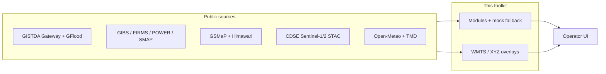

# DrNon Global Satellite Toolkit

**See Everything. Build Anything. Deploy Anywhere.**

A production-grade, open-source framework for building satellite-powered dashboards at any scale — from a single city to the entire planet. Clone it, point it at a geography, and you have a working situational awareness system in minutes.

> **Author:** Dr Non Arkaraprasertkul ([@Nonarkara](https://github.com/Nonarkara))
> PhD MA Harvard | MPhil Oxon | SM UrbanCertDes MIT | BArch First Class Honors
> Senior Expert in Smart City Promotion, Digital Economy Promotion Agency of Thailand (depa)
>
> **Original compilation, system design, architecture & product by Dr Non Arkaraprasertkul.**

---

## What This Is

This is not a satellite viewer. It's a **blueprint for building real-time global awareness systems**.

42,000+ lines of TypeScript. 38 pluggable data-source modules. 20+ satellite APIs from 80+ space agencies surveyed worldwide. A rendering pipeline that layers fire detection over vegetation indices over night-time lights over ocean bathymetry — on any base map, with any combination, and it always renders even when APIs go down.

It started as a hobby — "how many satellite feeds can I stack onto one map?" — and turned into the toolkit that powers production monitoring dashboards for smart city programs.

## What You Can Build With This

### Disaster Response & Emergency Operations
- Real-time wildfire tracking with NASA FIRMS thermal hotspot detection
- Flood extent monitoring via Sentinel-1 SAR and MODIS imagery
- Disaster event feeds from ReliefWeb with automatic geographic correlation
- Precipitation overlays from NASA IMERG for storm tracking
- Air quality crisis monitoring with PM2.5/NO₂/O₃ from OpenAQ and AQICN

### Smart City Command Centers
- Urban heat island detection via MODIS land surface temperature
- Traffic flow visualization from Longdo and highway camera feeds
- Public transit tracking — buses, trains, metro systems
- Environmental sensor dashboards with multi-station AQI
- Night-time economic activity mapping via VIIRS nightlights

### Defense & Geopolitical Intelligence
- Orbital awareness — track every satellite and debris object in real time via CelesTrak and Space-Track
- Armed conflict event mapping with ACLED (protests, battles, explosions, civilian targeting)
- GDELT global event monitoring — 300+ event types coded from news in 65 languages
- Air traffic pattern analysis for anomaly detection via OpenSky Network
- Overflight frequency analysis — which satellites are watching which regions, and when

### Climate & Environmental Monitoring
- Deforestation tracking with NDVI/EVI vegetation indices over time
- Ocean health via sea surface temperature and chlorophyll concentration layers
- Aerosol optical depth for air pollution transport analysis
- Multi-source weather fusion — TMD, Meteoblue, Open-Meteo, Meteosource
- Glacier retreat and snow cover monitoring via Sentinel-2

### Maritime & Border Surveillance
- AIS vessel tracking correlation with satellite overpass timing
- Coastline change detection via historical Landsat time series
- Illegal fishing zone monitoring with VIIRS boat detection
- Distance grid system with nautical mile support for maritime operations
- SAR (Synthetic Aperture Radar) for all-weather, day/night monitoring

### Agricultural Intelligence
- Crop health monitoring with NDVI/EVI vegetation indices
- Drought early warning via soil moisture and precipitation data
- Growing season analysis with multi-temporal Sentinel-2
- Flood damage assessment for crop insurance verification
- Regional weather forecasting for precision agriculture

### Urban Planning & Development
- Urban sprawl detection with historical satellite comparison
- Infrastructure change detection — new roads, buildings, construction sites
- Land use classification from multi-spectral imagery
- Population density estimation via nightlight intensity
- Transit-oriented development analysis with ridership data

### Journalism & Open-Source Intelligence (OSINT)
- Verify conflict claims with independent satellite imagery timestamps
- Track refugee camp growth via settlement pattern detection
- Environmental crime detection — illegal mining, deforestation, waste dumping
- Cross-reference news events (GDELT) with satellite imagery of affected locations
- Google Trends + news API fusion for narrative tracking

### Academic Research
- Longitudinal Earth observation studies with decades of Landsat/MODIS data
- Multi-source data fusion for peer-reviewed analysis
- Reproducible research with version-controlled data pipelines
- Access to 6 national space agency APIs (NASA, ESA, ISRO, JAXA, DLR, INPE) in one interface

---

## Architecture

```
┌─────────────────────────────────────────────────────────────────────┐
│                     LAYER STACK (top → bottom)                      │
├─────────────────────────────────────────────────────────────────────┤
│  Module Data Panels  (conflict events, air traffic, weather, news)  │
│  Labels & Annotations                                               │
│  Distance Grid       (500m / 1km / 5km / 10km + nautical miles)    │
│  Analytic Overlays   (AQI, aerosol, precipitation, fire detection) │
│  Satellite Imagery   (VIIRS, MODIS, Sentinel-2, Landsat)           │
│  Base Map            (Mapbox / OSM / LongDo / ESRI / CartoDB)      │
│  Gradient Fallback   (always renders — never a blank screen)       │
└─────────────────────────────────────────────────────────────────────┘

┌─────────────────────────────────────────────────────────────────────┐
│                     MODULE SYSTEM (38 data sources)                 │
├─────────────────────────────────────────────────────────────────────┤
│  Earth Observation    │  NASA, Sentinel/CDSE, ISRO, JAXA, GISTDA   │
│  Orbital & Air        │  OpenSky, CelesTrak, Space-Track, Flights  │
│  Conflict & Events    │  ACLED, GDELT, ReliefWeb, PredictHQ        │
│  Environmental        │  AQI, Open-Meteo wx, OpenAQ, TMD, Meteo    │
│  News & Trends        │  Google Trends, News API, GDELT News       │
│  Thailand-specific    │  SRT Trains, BTS/MRT, Smart Bus, Highways  │
├─────────────────────────────────────────────────────────────────────┤
│  Each module = 1 file with: fetch logic + mock data + UI hints     │
│  Add a module → it appears in the UI. Remove it → it vanishes.     │
└─────────────────────────────────────────────────────────────────────┘
```

### Fallback Philosophy

**The dashboard always renders.** Every layer, every module, every dependency has a fallback:

- **Base maps**: Mapbox → OSM → LongDo → ESRI → CartoDB → CSS Gradient
- **Satellite imagery**: NASA GIBS → Sentinel-2 (EOX) → ESRI World Imagery
- **Fire detection**: NASA FIRMS live → cached database → static fallback
- **Data modules**: Live API → mock data (realistic, same schema)
- **Storage**: Supabase → Firebase → PostgreSQL → Google Sheets → local cache

No API key? Mock data loads. API down? Cached data loads. Offline? Static fallback loads. **There is no failure state that produces a blank screen.**

Every tile fetch records metadata — provider, timestamp, latency, imagery date, HTTP status — so the system builds its own provider health dashboard over time.

---

## 38 Pluggable Data-Source Modules

The module system is the core innovation. Each data source is a **self-contained file** — one file per API, with fetch logic, realistic mock data, and UI rendering hints. Add or remove modules by editing one line in the registry.

### Earth Observation (12 modules)
| Module | Source | What It Shows |
|--------|--------|---------------|
| NASA FIRMS | NASA | Active fire/thermal hotspots worldwide, updated every 3 hours |
| NASA GIBS | NASA | 1,000+ daily satellite imagery layers via WMTS tiles |
| NASA POWER | NASA Langley | Daily 2 m temperature and precipitation for civic points (modelled GEOS fields) |
| NASA SMAP | NASA / NSIDC | L4 soil-moisture GIBS browse — drought context, modelled analysis not a probe |
| Sentinel Hub | ESA / Sinergise | Processed Sentinel-2 + Landsat with custom band combinations |
| Copernicus CDSE | ESA CDSE | Native STAC search for Sentinel-2 L2A and Sentinel-1 GRD over Thailand |
| ISRO Bhoonidhi | ISRO (India) | Resourcesat, NovaSAR, EOS data for South/Southeast Asia |
| JAXA Tellus | JAXA (Japan) | ALOS, GCOM, Himawari data for Asia-Pacific |
| JAXA GSMaP + Himawari | JAXA / NICT | GSMaP rainfall watch + Himawari browse freshness (estimated rain, not gauges) |
| GK2A | KMA (Korea) | Geostationary weather imagery for East/Southeast Asia |
| GISTDA Gateway | GISTDA | Open API `/features/flood/{1day,3days,7days,30days}`, flood-freq, water_hyacinth, VIIRS, burn-scar/freq |
| GISTDA GFlood | GISTDA | Open API `/maps/flood|flood-freq|viirs|burn-*|dri|ndwi|smap` WMS/WMTS/TMS |

### Orbital & Air Traffic (4 modules)
| Module | Source | What It Shows |
|--------|--------|---------------|
| OpenSky Network | Community | Real-time ADS-B aircraft positions worldwide |
| CelesTrak | 18th SPCS | TLE/OMM data for every tracked object in orbit |
| Space-Track | USSF | Official NORAD orbital catalog with decay predictions |
| FlightLabs Thai | AirLabs | BKK/DMK arrivals, departures, and Thai carrier tracking |

### Conflict & Events (5 modules)
| Module | Source | What It Shows |
|--------|--------|---------------|
| ACLED | ACLED | Expert-coded armed conflict events, protests, political violence |
| GDELT Events | GDELT Project | 300+ CAMEO-coded event types from global news in 65 languages |
| GDELT News | GDELT Project | Real-time news volume and tone by geography |
| ReliefWeb | UN OCHA | Humanitarian disaster reports, situation updates, maps |
| PredictHQ | PredictHQ | Scheduled + unscheduled real-world events with impact scoring |

### Environmental (7 modules)
| Module | Source | What It Shows |
|--------|--------|---------------|
| Open-Meteo AQI | Open-Meteo | Free global air quality index with PM2.5, NO₂, O₃ |
| Open-Meteo Forecast | Open-Meteo | 7-day NWP forecast for Thai civic cities (modelled, not TMD stations) |
| OpenAQ | OpenAQ | Ground-station air quality measurements worldwide |
| AQICN Thailand | AQICN | Thai-specific AQI with station-level PM2.5 readings |
| TMD Weather | Thai Met Dept | Official Thai weather warnings and forecasts |
| Meteoblue | Meteoblue | 100+ weather variables globally, 14-day forecasts |
| Meteosource | Meteosource | Hyperlocal weather for Thai cities |

### News & Information (2 modules)
| Module | Source | What It Shows |
|--------|--------|---------------|
| Google Trends | Google | Real-time search interest by topic and region |
| News API | NewsAPI | Global news aggregation with keyword/source filtering |

### Thailand-Specific (8 modules)
| Module | Source | What It Shows |
|--------|--------|---------------|
| Phuket Smart Bus | PKSB | Live GPS positions of Phuket public buses |
| SRT Trains | SRT Thailand | Intercity rail positions and delay tracking |
| BTS/MRT | Community | Bangkok metro station data and route computation |
| Longdo Traffic | Longdo | Thai road traffic density and congestion |
| Highway Cameras | DOH Thailand | Live highway camera feeds nationwide |
| Gov Open Data | data.go.th | Thai government open datasets |
| Provinces | Admin data | All 77 provinces with demographic and geographic data |
| GTFS Buses | GTFS feeds | Standardized Bangkok bus route and schedule data |

---

## Global Satellite API Registry

The most comprehensive open-source compilation of satellite data APIs in existence. Surveyed **80+ space agencies** worldwide (per UNOOSA/WMO OSCAR directories). Found **20+ true public APIs** — the rest are portal-only or commercial.

### Key Finding
Most people think satellite data is expensive or classified. It's not. **The majority of Earth observation data is free and publicly accessible** — the problem is that nobody has compiled all the endpoints in one place. Until now.

### Tier 1: Popular APIs (High Adoption)

| API | Agency | Auth | Protocol | Coverage |
|-----|--------|------|----------|----------|
| **Sentinel Hub** | ESA | OAuth | STAC | Global — all Sentinel, Landsat, MODIS |
| **Google Earth Engine** | Google | OAuth | REST | Planetary-scale analysis — **not** a free gov tile CDN (see ethics) |
| **Copernicus CDSE STAC** | ESA | None (search) | STAC | Sentinel-1/2 catalog; downloads need a CDSE account |
| **NASA POWER** | NASA | None | REST | Daily climate ARD (modelled GEOS) |
| **NASA GIBS** | NASA | None | WMTS | Global — 1,000+ daily layers |
| **NASA CMR STAC** | NASA | None | STAC | All NASA data holdings |
| **Planet Labs** | Planet | API Key | REST | Global daily 3-5m optical |
| **MS Planetary Computer** | Microsoft | None | STAC | Global aggregated STAC |
| **N2YO** | Community | API Key | REST | Real-time orbital tracking |
| **Open Notify** | Community | None | REST | ISS position |

### Tier 2: Pro-Level APIs (Low Hype, High Reliability)

| API | Agency | Auth | Protocol | Coverage |
|-----|--------|------|----------|----------|
| **Celestrak GP** | 18 SPCS | None | REST | All NORAD objects (OMM/TLE) |
| **Space-Track** | USSF | Registration | REST | Official orbital catalog |
| **SatNOGS** | Libre Space | None | REST | Amateur satellite telemetry |
| **TLE API** | Community | None | REST | JSON TLE wrapper |
| **OpenEO** | EU Consortium | OAuth | REST | Unified processing backends |
| **EUMETSAT** | EUMETSAT | Registration | REST | Geostationary weather |

### Tier 3: Niche / Regional APIs

| API | Agency | Country | Protocol | Coverage |
|-----|--------|---------|----------|----------|
| **ISRO Bhoonidhi** | ISRO/NRSC | India | STAC | Resourcesat, EOS, NovaSAR |
| **DEA STAC** | Geoscience AU | Australia | STAC | Landsat/Sentinel ARD |
| **Digital Earth Africa** | SANSA | South Africa | STAC | Africa continent |
| **DLR EOC** | DLR | Germany | STAC | National EO collections |
| **CSA Open Data** | CSA | Canada | REST | RADARSAT, NEOSSat |
| **INPE STAC** | INPE | Brazil | STAC | CBERS, Amazonia-1 |
| **JAXA Earth** | JAXA | Japan | REST | ALOS, GCOM, Himawari |
| **JAXA GSMaP** | JAXA | Japan | REST/FTP | Global satellite rainfall estimates |
| **GISTDA Gateway** | GISTDA | Thailand | REST | Open API `/features/flood|flood-freq|viirs|burn-*` |
| **GISTDA GFlood** | GISTDA | Thailand | WMS/WMTS/TMS | Open API `/maps/flood|viirs|dri|ndwi|smap` |
| **Roscosmos STAC** | Roscosmos | Russia | STAC | Resurs-P, Kanopus-V |

### Portal-Only Agencies (No Public API)

~65-70 agencies have **zero public APIs** for their national satellite archives. Notable examples: China (CNSA/CRESDA Gaofen), South Korea (KARI/KOMPSAT), Argentina (CONAE/SAOCOM), Algeria, Turkey, UAE, Iran, Mexico, Indonesia, Vietnam, Philippines.

**GISTDA has a public Disaster Platform Open API** (this is not portal-only). Base `https://api-gateway.gistda.or.th/api/2.0/resources`, docs https://disaster.gistda.or.th/services/open-api, STAC UI https://disaster.gistda.or.th/services/stac. Flood/fire/drought features and WMS/WMTS/TMS are listed in [`docs/FREE-EO-SOURCES.md`](docs/FREE-EO-SOURCES.md). THEOS scene archive remains commercial/portal. Do not scrape FloodDash or `/app-api/proxy` internals. Env name only: `GISTDA_API_KEY`.

Full details with endpoints in [`src/registry/global-satellite-apis.ts`](src/registry/global-satellite-apis.ts).

---

## Satellite Imagery Overlays

10 raster overlays from 6 providers, plus SMAP soil moisture and GISTDA GFlood 2011, all consumable via standard WMTS/XYZ tiles:

| Overlay | Source | What It Reveals |
|---------|--------|-----------------|
| VIIRS True Color | NASA GIBS | Daily global imagery at 375m — see the Earth as it looks today |
| MODIS False Color | NASA GIBS | Vegetation health — red = stressed, green = healthy |
| Blue Marble Relief | NASA GIBS | Terrain and bathymetry in stunning detail |
| Vegetation Index (EVI) | NASA GIBS | Quantified plant health — track droughts, deforestation, crop cycles |
| Night Lights | NASA GIBS | Human activity patterns — urbanization, economic output, conflict blackouts |
| Precipitation Rate | NASA IMERG | Where it's raining right now, globally |
| Aerosol Optical Depth | NASA MODIS | Air pollution transport — see smoke plumes, dust storms, haze events |
| Sentinel-2 Cloudless | EOX/ESA | Cloud-free annual composite at 10m resolution |
| Surface Water | JRC/Google | Every lake, river, and reservoir mapped and tracked over time |
| Ocean Bathymetry | EMODnet/GEBCO | Seafloor depth for maritime and coastal analysis |
| SMAP Surface Moisture | NASA GIBS / SMAP L4 | Modelled land-surface soil moisture (not an in-situ probe) |
| GISTDA GFlood 2011 | GISTDA | Historical 2011 flood footprint tiles — not live inundation |

---

## Use It As a Template

This toolkit is designed to be a **starting point, not a finished product**. The intended workflow:

1. **Clone** the repo
2. **Pick your geography** — change the map center and zoom
3. **Enable the modules** you need — toggle them in the registry
4. **Add client-specific modules** — copy `_template.ts`, fill in the API logic
5. **Deploy** — it's a standard Next.js app, deploy anywhere

### Example: Build a Disaster Response Dashboard in 10 Minutes

```bash
git clone https://github.com/Nonarkara/DrNon-Global-Satellite-Toolkit.git my-disaster-dashboard
cd my-disaster-dashboard
npm install

# Set your FIRMS key for live fire data
echo "FIRMS_KEY=your_key_here" > .env.local

npm run dev
```

Enable these modules in the UI: **NASA FIRMS** + **GISTDA Gateway** + **GISTDA GFlood** + **JAXA GSMaP + Himawari** + **Copernicus CDSE** + **Open-Meteo Forecast** + **ReliefWeb**. Add `GISTDA_API_KEY` to fetch live Open API GeoJSON (`/features/flood|viirs|burn-*`) and tiles (`/maps/flood|viirs|dri|ndwi|smap`). You now have fire detection, Thai flood/fire/drought products, estimated rainfall, Sentinel catalog, modelled weather, and humanitarian alerts — with mock fallbacks if keys are missing.

Free-EO catalog (real URLs, measured vs modelled, GISTDA attribution, Earth Engine licence): [`docs/FREE-EO-SOURCES.md`](docs/FREE-EO-SOURCES.md).

### Example: Build a Smart City Command Center

Same repo, different modules: **Longdo Traffic** + **AQICN Thailand** + **TMD Weather** + **Phuket Smart Bus** + **Highway Cameras**. You now have urban mobility, environmental monitoring, and transit tracking in one interface.

### Example: Build an OSINT Geopolitical Monitor

Enable: **ACLED** + **GDELT Events** + **OpenSky Network** + **CelesTrak** + **Google Trends** + **Night Lights**. You now have conflict events, air traffic patterns, satellite overpass awareness, media narrative tracking, and economic activity indicators — all on one map.

---

## Adding Your Own Modules

Every module is one file. Copy the template:

```bash
cp src/modules/_template.ts src/modules/my-category/my-source.ts
```

Fill in 5 things:
1. **`id`** — unique string
2. **`label`** — human-readable name
3. **`category`** — which drawer it appears in
4. **`fetchData()`** — the API call (or scrape, or computation)
5. **`mockData`** — realistic fallback data (same schema as live)

Add one import line to `src/modules/registry.ts`. Done. It appears in the module selector, gets a dynamic API route, and the React hook can consume it.

---

## Distance Grid System

4 grid presets with automatic zoom-level selection and Mercator correction:

| Preset | Cell Size | Major Lines | Nautical Miles |
|--------|-----------|-------------|----------------|
| 500m | 0.5 km | Every 1 km | ~0.27 nm |
| 1 km | 1.0 km | Every 5 km | ~0.54 nm |
| 5 km | 5.0 km | Every 10 km | ~2.70 nm |
| 10 km | 10.0 km | Every 50 km | ~5.40 nm |

Grids auto-adjust longitude spacing by latitude and suppress when too dense. Nautical mile conversion included for maritime use cases.

## Storage & Database

Supports 5 storage backends with automatic resolution:

| Backend | Best For | Free Tier |
|---------|----------|-----------|
| **Supabase** | Primary DB with PostGIS, real-time | 500MB DB, 1GB storage |
| **Firebase** | Document store, real-time listeners | 1GB Firestore, 5GB storage |
| **PostgreSQL** | Self-hosted, full control | Self-hosted |
| **Google Sheets** | Non-sensitive data, easy sharing | Free with Google account |
| **Local Cache** | Offline fallback | Always available |

## Quick Start

```bash
git clone https://github.com/Nonarkara/DrNon-Global-Satellite-Toolkit.git
cd DrNon-Global-Satellite-Toolkit
npm install
npm run dev
# Open http://localhost:3000
```

No API keys required to start — every module has mock data that loads automatically. Add keys to `.env.local` as needed for live data.

### Use as a Library

```typescript
import {
  buildMapOverlayCatalog,
  createGIBSLayer,
  createDistanceGridLayer,
  GRID_PRESETS,
  getBestBasemap,
  allApis,
  registryStats,
  getModuleCatalog,
  getAllModules,
} from "drnon-global-satellite-toolkit";

// Browse the global API registry
console.log(`${registryStats.totalApis} satellite APIs cataloged`);
console.log(`${registryStats.noAuthCount} require no authentication`);

// Get all satellite overlays for a date
const catalog = buildMapOverlayCatalog("2024-03-01");

// Create a VIIRS layer for Deck.gl
const viirsLayer = createGIBSLayer({
  id: "viirs",
  layer: "VIIRS_SNPP_CorrectedReflectance_TrueColor",
  date: "2024-03-01",
});

// List all available data modules
const modules = getModuleCatalog();
console.log(`${modules.total} data source modules available`);
```

## Environment Variables

All optional — the system works without any keys using mock data and free basemaps.

```bash
# Satellite data
FIRMS_KEY=                          # NASA FIRMS thermal detection (free)

# Module API keys (all optional — mock data used when absent)
ACLED_KEY=                          # Armed conflict data
ACLED_EMAIL=                        # ACLED registration email
SENTINEL_HUB_KEY=                   # ESA processed imagery (classic Sentinel Hub)
GISTDA_API_KEY=                     # GISTDA disaster gateway (register at api-gateway.gistda.or.th/v2)
SPACE_TRACK_USER=                   # NORAD orbital catalog
SPACE_TRACK_PASS=
FLIGHTLABS_KEY=                     # Aviation data
METEOBLUE_KEY=                      # High-res weather
METEOSOURCE_KEY=                    # Hyperlocal weather
PREDICTHQ_KEY=                      # Event intelligence
NEWS_API_KEY=                       # News aggregation

# Base maps (all optional — OSM works without any tokens)
NEXT_PUBLIC_MAPBOX_ACCESS_TOKEN=    # Mapbox
LONGDO_MAP_KEY=                     # LongDo Map (free, Thai-optimized)
STADIA_API_KEY=                     # Stadia Maps

# Database (pick one, or none for local cache)
DATABASE_URL=                       # PostgreSQL with PostGIS
SUPABASE_URL=                       # Supabase
SUPABASE_ANON_KEY=
```

## Key Design Decisions

1. **No satellite processing on the client** — We consume pre-processed tiles via WMTS/XYZ endpoints, not raw imagery. The client stays lightweight.

2. **STAC is the universal standard** — Any STAC-compatible API can be queried with `pystac-client`. The registry tracks which agencies support it.

3. **Mock data is not optional** — Every module ships realistic mock data with the same schema as live responses. This means the dashboard works on day zero with zero configuration.

4. **Resilience over features** — Every external dependency has a fallback chain. The dashboard works offline, without API keys, and with intermittent connectivity.

5. **One file per data source** — Adding a module never requires editing more than 2 files (the module itself + one line in the registry). Removing a module is the reverse.

6. **Metadata everywhere** — Every tile fetch and API call logs provider, timestamp, latency, and status. This builds an audit trail for accuracy and provider health over time.

---

## How a civic disaster dashboard is wired



Verified endpoints, licences, and “do not scrape FloodDash” notes: [`docs/FREE-EO-SOURCES.md`](docs/FREE-EO-SOURCES.md).

## Ethics for civic EO

1. **Label measured vs modelled.** Sentinel-1 GRD and Sentinel-2 L2A are measurements. GSMaP rain, NASA POWER, Open-Meteo forecasts, SMAP L4, and GFlood prediction polygons are models or analyses. Historical recurrence is not a live flood.
2. **Do not scrape private FloodDash or disaster-platform HTML.** Use the published Gateway and OGC services.
3. **Attribute GISTDA** on Thai disaster layers (Open Data Common on the CKAN records; contact `wgs@gistda.or.th`).
4. **Google Earth Engine:** noncommercial EECU quota is for research/education/nonprofit analysis. Operational government web apps and production tile CDNs need a [commercial licence](https://earthengine.google.com/commercial/). See [noncommercial terms](https://earthengine.google.com/noncommercial/).
5. **No secrets in git** — environment *names* only in `.env.example`.

---

## Who This Is For

- **Smart city teams** who need a situational awareness dashboard without building from scratch
- **Disaster response organizations** who need fire/flood/weather monitoring in hours, not months
- **Defense and intelligence analysts** who want open-source satellite + OSINT fusion
- **Climate researchers** who need multi-source environmental data on one screen
- **Journalists and OSINT investigators** who verify events with satellite evidence
- **Urban planners** who want to see how cities grow, breathe, and move
- **Developers** who want a production-grade geospatial template instead of a tutorial project
- **Anyone** who wants to understand what's happening on Earth, right now, from open data

---

## Author & Attribution

This toolkit — including the global satellite API registry, overlay engine, module system, fallback architecture, distance grid system, and storage design — is an original compilation and product by **Dr Non Arkaraprasertkul** ([@Nonarkara](https://github.com/Nonarkara)).

**Dr Non Arkaraprasertkul**
PhD MA Harvard | MPhil Oxon | SM UrbanCertDes MIT | BArch First Class Honors
Senior Expert in Smart City Promotion
Digital Economy Promotion Agency of Thailand (depa)
Bangkok, Thailand 10900

The satellite API registry was compiled through exhaustive research of 80+ space agencies per UNOOSA/WMO OSCAR directories, cross-referenced against global STAC indexes, developer portals, and open-data catalogs. The module system and overlay engine were extracted from production geopolitical monitoring dashboards.

Most of the world's satellite data is free. Most people don't know that. This toolkit exists so that the barrier to building something meaningful with that data is as close to zero as possible.

## License

MIT — see [LICENSE](LICENSE).
