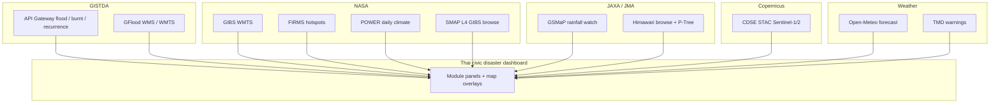

# Free Earth Observation sources for Thai civic disaster dashboards

Catalog of **public, documented** EO and weather endpoints this toolkit can use without inventing APIs. Last verified **2026-09-02**.

This is for municipal / civic dashboards (flood, fire, drought, storm context) — not a substitute for official Thai warning services (TMD, DDPM). Always show **who produced the layer** and whether the value is **measured** or **modelled**.

## Ethics (read this first)

1. **Measured vs modelled.** Optical/SAR pixels and rain gauges are observations. GSMaP rain rates, NASA POWER, Open-Meteo forecasts, SMAP L4, and GFlood prediction polygons are models or analyses. Label them in the UI.
2. **Do not scrape private FloodDash or the Disaster Platform HTML.** GISTDA already publishes a gateway and OGC map services. Hitting unpublished dashboards, session cookies, or internal apps is out of scope.
3. **Attribute GISTDA** on every Thai disaster layer: *Geo-Informatics and Space Technology Development Agency (GISTDA)*. Open Data records use the **Open Data Common** licence and list contact `wgs@gistda.or.th`.
4. **Google Earth Engine is not a free government tile CDN.** Noncommercial EECU quota is for research/education/nonprofit analysis. Operational, ongoing civic apps and production tile serving need a **commercial / government-operational** licence. See [Noncommercial](https://earthengine.google.com/noncommercial/) and [Commercial](https://earthengine.google.com/commercial/).
5. **No secrets in git.** Put only environment *names* in `.env.example`. Register your own keys.

---

## NASA

| Resource | What it is | Access | Evidence class | Attribution / docs |
|----------|------------|--------|----------------|--------------------|
| **GIBS WMTS** | Daily browse tiles (VIIRS, MODIS, IMERG, …) | No key. `https://gibs.earthdata.nasa.gov/wmts/epsg3857/best/{layer}/default/{date}/GoogleMapsCompatible_Level{z}/{z}/{y}/{x}.{format}` | Browse imagery of satellite measurements (not analysis-ready HDF) | [GIBS API docs](https://nasa-gibs.github.io/gibs-api-docs/) |
| **FIRMS** | Thermal hotspot CSV/API | Free map key: [FIRMS realtime API](https://firms.modaps.eosdis.nasa.gov/api/config/realtime/) | Satellite thermal detections (not confirmed ground fires) | NASA FIRMS |
| **POWER Daily API** | Point climate ARD (T2M, precip, solar, …) | No key. `https://power.larc.nasa.gov/api/temporal/daily/point` | **Modelled** GEOS fields (~0.5° met) | [POWER](https://power.larc.nasa.gov/) · [Daily API](https://power.larc.nasa.gov/docs/services/api/temporal/daily/) · CC BY 4.0 |
| **SMAP** | Soil moisture | Science granules: [NSIDC SMAP](https://nsidc.org/data/smap) (Earthdata login). Browse: GIBS layers `SMAP_L4_Analyzed_Surface_Soil_Moisture`, `SMAP_L4_Analyzed_Root_Zone_Soil_Moisture` | **L4 = modelled analysis** (SMAP observations + land model). L3 is closer to the radiometer but coarser | [GIBS SMAP announcement](https://www.earthdata.nasa.gov/news/blog/16-new-smap-products-now-available) · [SPL4SMAU v8](https://nsidc.org/data/spl4smau/versions/8) |
| **CMR STAC** | NASA catalog search | `https://cmr.earthdata.nasa.gov/stac` | Metadata only | [CMR STAC](https://cmr.earthdata.nasa.gov/stac/docs/index.html) |

POWER is **not** SMAP. Do not request soil moisture from POWER.

---

## JAXA (and JMA / NICT Himawari browse)

| Resource | What it is | Access | Evidence class | Attribution / docs |
|----------|------------|--------|----------------|--------------------|
| **GSMaP Global Rainfall Watch** | Global satellite rainfall maps, ~0.1°, ~30 min NRT | Viewer + FTP: [sharaku GSMaP](https://sharaku.eorc.jaxa.jp/GSMaP/) · [User guide](https://sharaku.eorc.jaxa.jp/GSMaP/guide.html) · JAXA portal overview: [data download sites](https://earth.jaxa.jp/en/eo-knowledge/data-portal/index.html) | **Satellite-estimated precipitation** (algorithm), not a Thai rain gauge. Gauge-adjusted products exist separately | JAXA EORC / GPM GSMaP |
| **JAXA Earth API** | COG/STAC-style access to JAXA datasets | [data.earth.jaxa.jp](https://data.earth.jaxa.jp/) · [Python client](https://data.earth.jaxa.jp/api/python) · [Explorer](https://data.earth.jaxa.jp/app/explorer) | Dataset-dependent | [Announcement](https://earth.jaxa.jp/en/earthview/2022/06/09/7024/index.html) · [JAXA research data policy](https://earth.jaxa.jp/en/data/policy/index.html) |
| **G-Portal** | JAXA EO search / order | [gportal.jaxa.jp](https://gportal.jaxa.jp/gpr/?lang=en) | Granules | Free registration |
| **G-Portal WMS** | OGC WMS for some GCOM/GSMaP layers | Documented `https://gpwmap.jaxa.jp/ows` in the [G-Portal Web API WMS tutorial](https://eolp.jaxa.jp/webapi/tutorials/wms/jupyter.html) | Rendered products | Some networks/WAFs reject `/ows`; treat as optional |
| **Himawari P-Tree** | JMA Himawari Standard Data + JAXA geophysical products | [P-Tree](https://www.eorc.jaxa.jp/ptree/) · [User guide](https://www.eorc.jaxa.jp/ptree/userguide.html) · [FAQ / licence dates](https://www.eorc.jaxa.jp/ptree/faq.html) | Science data via FTP (account). Licence changes by observation date | JAXA / JMA |
| **JMA MSC Himawari images** | Official MSC browse | [mscweb Himawari](https://www.data.jma.go.jp/mscweb/data/himawari/) | Browse imagery | JMA |
| **NICT Himawari PNG timestamp** | Full-disk true-color browse | `https://himawari8.nict.go.jp/img/D531106/latest.json` | Browse only — good for “is the disk current?”, not rainfall | NICT Himawari real-time |

Do not treat GSMaP millimetres as TMD station rainfall.

---

## Copernicus Data Space Ecosystem (CDSE)

Native ESA/EU path — **distinct from** Sentinel Hub classic (`services.sentinel-hub.com`), which this repo already wraps.

| Resource | URL | Notes |
|----------|-----|--------|
| Ecosystem | https://dataspace.copernicus.eu | Free account for downloads |
| STAC catalog (current) | https://stac.dataspace.copernicus.eu/v1 | [STAC docs](https://documentation.dataspace.copernicus.eu/APIs/STAC.html). Legacy `https://catalogue.dataspace.copernicus.eu/stac` was deprecated 17 Nov 2025 |
| Sentinel-2 L2A collection | https://stac.dataspace.copernicus.eu/v1/collections/sentinel-2-l2a | Optical surface reflectance. **Measured**, clouds still obscure ground |
| Sentinel-1 GRD collection | https://stac.dataspace.copernicus.eu/v1/collections/sentinel-1-grd | C-band SAR. **Measured** backscatter — not a flood mask until processed |
| STAC Browser | https://browser.stac.dataspace.copernicus.eu | Human catalog |
| Identity (downloads) | https://identity.dataspace.copernicus.eu/auth/realms/CDSE/.well-known/openid-configuration | OAuth for assets / S3. Catalog search needs no secret |
| Legal notice | [Sentinel data legal notice](https://sentinel.esa.int/documents/247904/690755/Sentinel_Data_Legal_Notice) | Cite “Copernicus Sentinel data [year]” |

Search example (Thailand bbox, public): `POST https://stac.dataspace.copernicus.eu/v1/search` with `collections: ["sentinel-2-l2a"]` or `["sentinel-1-grd"]` and `bbox: [97.3, 5.6, 105.7, 20.5]`.

---

## Google Earth Engine — licence caution

Earth Engine is an **analysis platform**, not a drop-in WMTS CDN for a municipal map.

| Use | Licence | Link |
|-----|---------|------|
| Research, education, nonprofit noncommercial | Free, with **noncommercial quota / EECU tiers** | [Noncommercial](https://earthengine.google.com/noncommercial/) |
| Commercial, fee-for-service, **government operational** apps, repeated production of data products, ongoing web applications | **Commercial / GCP Earth Engine** | [Commercial](https://earthengine.google.com/commercial/) · [Terms](https://earthengine.google.com/terms/) |

Google’s noncommercial page states that government agencies **may not** use free Earth Engine for (among other things) repeated production of data products, tooling for management/policy/web applications, or datasets whose primary goal is operational workloads. **Noncommercial EECU ≠ production gov tile CDN.**

This toolkit therefore does **not** ship an Earth Engine tile module. Use GIBS, CDSE, GISTDA OGC, and JAXA portals for operational maps; use EE only where the licence matches the project.

---

## Free / low-friction basemaps

From `src/basemaps/basemap-catalog.ts` (already in the template):

| Basemap | Tile URL | Token | Attribution |
|---------|----------|-------|-------------|
| OpenStreetMap | `https://tile.openstreetmap.org/{z}/{x}/{y}.png` | No | OpenStreetMap contributors |
| ESRI World Imagery | `https://server.arcgisonline.com/ArcGIS/rest/services/World_Imagery/MapServer/tile/{z}/{y}/{x}` | No | Esri, Maxar, Earthstar Geographics |
| ESRI World Topo | `https://server.arcgisonline.com/ArcGIS/rest/services/World_Topo_Map/MapServer/tile/{z}/{y}/{x}` | No | Esri |
| CARTO Positron | `https://basemaps.cartocdn.com/light_all/{z}/{x}/{y}@2x.png` | No | CARTO |
| CARTO Dark Matter | `https://basemaps.cartocdn.com/dark_all/{z}/{x}/{y}@2x.png` | No | CARTO |
| Longdo Map | `https://ms.longdo.com/mmmap/tile.php?...` | `LONGDO_MAP_KEY` | Metamedia Technology / LongDo Map |
| Mapbox | `mapbox://styles/...` | `NEXT_PUBLIC_MAPBOX_ACCESS_TOKEN` | Mapbox |
| Stadia / Stamen | `https://tiles.stadiamaps.com/tiles/...` | `STADIA_API_KEY` | Stadia Maps, Stamen Design, OSM |
| EOX Sentinel-2 Cloudless | `https://tiles.maps.eox.at/wmts/1.0.0/s2cloudless-2021_3857/default/g/{z}/{y}/{x}.jpg` | No | EOX / Sentinel-2 (annual mosaic, not disaster NRT) |

Respect OSM tile usage policy; do not hammer `tile.openstreetmap.org` from a high-traffic CDN without a dedicated tile server.

---

## GISTDA (Thailand)

**THEOS-1/2 archive imagery** is still largely portal / commercial — that older “no public API” claim applied to THEOS, not to disaster products.

### Disaster Platform Open API (API key)

- Docs UI: **https://disaster.gistda.or.th/services/open-api**
- Register a key: **https://api-gateway.gistda.or.th/v2**
- Base: **https://api-gateway.gistda.or.th/api/2.0/resources**
- STAC UI: **https://disaster.gistda.or.th/services/stac** (retrospective catalog; flood items may be empty — not a live tile CDN)
- Download portal: `https://disaster.gistda.or.th/services/download?type=flood` (also `fire`, `drought`, `other`). Includes Sentinel-1C/1D SAR flood scene rows for **retrospective** SAR, not a live TMS.
- Air quality is a **separate** site: https://air.gistda.or.th

Unauthenticated calls to the gateway return **HTTP 407 Authentication Required** (the paths exist). Do **not** document or call session internals under `/app-api/proxy/...`.

| Kind | Paths (append to base) | Evidence |
|------|------------------------|----------|
| Flood features | `/features/flood/1day`, `/3days`, `/7days`, `/30days`, `/features/flood-freq`, `/features/water_hyacinth` | Mapped flood features / historical frequency |
| Flood maps | `/maps/flood/{1day,3days,7days,30days}/{wms\|wmts\|tms/{z}/{x}/{y}}`, `/maps/flood-freq/{wms\|wmts\|tms/...}` | **Primary live civic tiles** (key required) |
| Fire | `/features/viirs/{1day,3days,7days,30days}`, `/features/burn-freq`, `/features/burn-scar` + matching `/maps/viirs\|burn-freq\|burn-scar` | VIIRS hotspots / burn scar / frequency |
| Drought maps | `/maps/dri\|ndwi\|smap/7days/{wms\|wmts\|tms/...}` | 7-day drought indices. GISTDA `smap` map ≠ NASA SMAP L4 GIBS |

Example TMS: `https://api-gateway.gistda.or.th/api/2.0/resources/maps/flood/1day/tms/{z}/{x}/{y}` (send `api_key`).

### GISTDA Open Data (CKAN) point APIs

Same gateway host; published on [opendata.gistda.or.th](https://opendata.gistda.or.th). Licence: Open Data Common. Contact: `wgs@gistda.or.th`.

| Product | Catalog | URL |
|---------|---------|-----|
| Flood recurrence 2011–2023 | [disasters-01](https://opendata.gistda.or.th/en/dataset/disasters-01) | `.../gi-service/v1.0/disasters/flood-recurrence?lat=&lon=&api_key=` |
| Drought recurrence 2018–2023 | [disasters-02](https://opendata.gistda.or.th/en/dataset/disasters-02) | `.../disasters/drought-recurrence?lat=&lon=&api_key=` |
| Flood extent (1-day) | [disasters-03](https://opendata.gistda.or.th/en/dataset/disasters-03) | `.../disasters/flood-extent-1day?lat=&lon=&api_key=` |
| Burnt area latest | [disasters-04](https://opendata.gistda.or.th/en/dataset/disasters-04) | `.../disasters/burnt-area-latest?lat=&lon=&api_key=` |

### GFlood ArcGIS REST (no gateway key for the directory)

Public OGC/REST **in addition to** the Open API. Useful without a key for service discovery.

| Service | URL |
|---------|-----|
| Folder | https://gistdaportal.gistda.or.th/data/rest/services/GFlood |
| WMS MapServer | https://gistdaportal.gistda.or.th/data/rest/services/GFlood/GFlood_Inno_WMS/MapServer |
| OGC WMS GetCapabilities | https://gistdaportal.gistda.or.th/data/services/GFlood/GFlood_Inno_WMS/MapServer/WMSServer?service=WMS&request=GetCapabilities |
| WMTS 3857 MapServer | https://gistdaportal.gistda.or.th/data/rest/services/GFlood/GFlood_Inno_WMTS3857/MapServer |
| XYZ tiles (cached) | `https://gistdaportal.gistda.or.th/data/rest/services/GFlood/GFlood_Inno_WMTS3857/MapServer/tile/{z}/{y}/{x}` |

As of 2026-09-02 the WMS advertises `rain_30min.tif`, `FloodArea_Poly`, and `flood_prediction_union` (layers `0`, `1`, `2`). The WMTS cache advertises **`Flood_Y2011`** — a **2011 flood footprint**, not live inundation. `flood_prediction_union` is a **modelled** prediction polygon.

**Out of scope**

- Scraping the Disaster Platform map UI or any private FloodDash
- Calling undocumented `/app-api/proxy/...` session endpoints
- Redistributing THEOS commercial scenes

---

## Open-Meteo (weather, not EO)

| API | URL | Evidence |
|-----|-----|----------|
| Forecast | https://api.open-meteo.com/v1/forecast · [docs](https://open-meteo.com/en/docs) | **Modelled** NWP. Complements TMD warnings; does not replace them |
| Air quality (already in toolkit) | Open-Meteo AQI module | Modelled AQ fields |

Attribution: [Weather data by Open-Meteo.com](https://open-meteo.com/).

---

## Toolkit modules added for this catalog

| Module id | Live without a key? | Wraps |
|-----------|---------------------|--------|
| `gistda-gateway` | No (`GISTDA_API_KEY`) | Open API `/features/flood|viirs|burn-*` |
| `gistda-gflood` | Yes (ArcGIS directory) | Open API map templates + public GFlood WMS/WMTS |
| `jaxa-gsmap` | Yes (portal + NICT probe) | GSMaP + Himawari freshness |
| `copernicus-cdse` | Yes (STAC search) | CDSE Sentinel-1/2 catalog |
| `open-meteo-forecast` | Yes | Open-Meteo forecast |
| `nasa-power` | Yes | POWER daily point |
| `nasa-smap` | Yes | GIBS SMAP L4 browse probe |

Existing modules that already cover part of this stack: `nasa-firms`, `nasa-gibs`, `sentinel-hub` (classic processing API), `jaxa-tellus`, `open-meteo-aqi`, `tmd-weather`.
